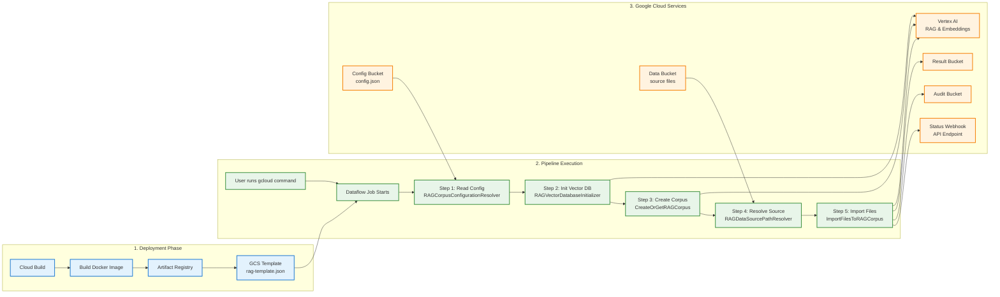
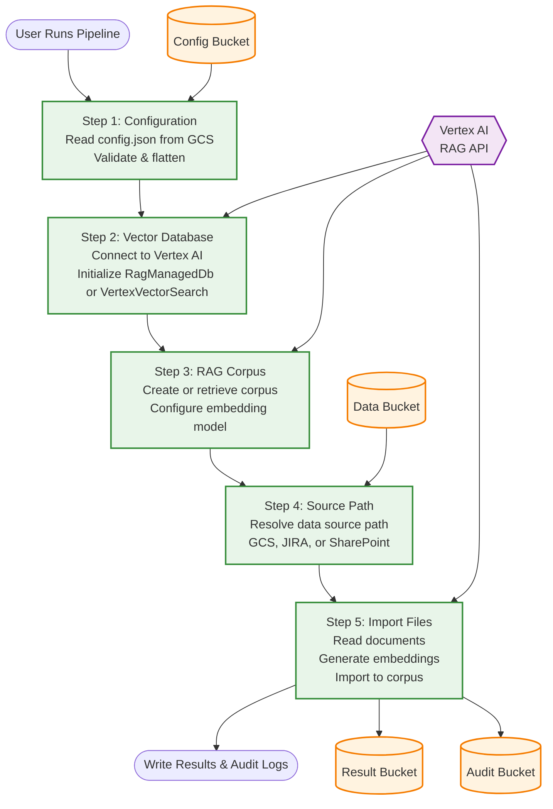

# RAG Pipeline - Google Cloud Dataflow Flex Template

A production-ready, scalable solution for building Retrieval-Augmented Generation (RAG) systems using Google Cloud Dataflow Flex Templates and Vertex AI.

## 🚀 Quick Start

**Deploy:**
```bash
gcloud builds submit --config cloudbuild.yaml
``` 

**Run Pipeline (Basic):**
```bash
gcloud dataflow flex-template run "rag-pipeline-$(date +%Y%m%d-%H%M%S)" \
  --template-file-gcs-location="gs://YOUR_TEMPLATE_BUCKET/rag-template.json" \
  --project="YOUR_PROJECT_ID" \
  --region="YOUR_REGION" \
  --service-account-email="YOUR_SERVICE_ACCOUNT@YOUR_PROJECT.iam.gserviceaccount.com" \
  --parameters="config_source=gcs,config_bucket=YOUR_CONFIG_BUCKET,config_file_pattern=config.json,result_bucket=YOUR_RESULT_BUCKET,audit_bucket=YOUR_AUDIT_BUCKET"
```

**Run Pipeline (with Status Webhook - Recommended):**
```bash
gcloud dataflow flex-template run "rag-pipeline-$(date +%Y%m%d-%H%M%S)" \
  --template-file-gcs-location="gs://YOUR_TEMPLATE_BUCKET/rag-template.json" \
  --project="YOUR_PROJECT_ID" \
  --region="YOUR_REGION" \
  --service-account-email="YOUR_SERVICE_ACCOUNT@YOUR_PROJECT.iam.gserviceaccount.com" \
  --parameters="config_source=gcs,config_bucket=YOUR_CONFIG_BUCKET,config_file_pattern=config.json,result_bucket=YOUR_RESULT_BUCKET,audit_bucket=YOUR_AUDIT_BUCKET,status_webhook_url=https://your-api.com/api"
```

**Run Pipeline (with Custom Subnet - Optional):**
```bash
gcloud dataflow flex-template run "rag-pipeline-$(date +%Y%m%d-%H%M%S)" \
  --template-file-gcs-location="gs://YOUR_TEMPLATE_BUCKET/rag-template.json" \
  --project="YOUR_PROJECT_ID" \
  --region="YOUR_REGION" \
  --service-account-email="YOUR_SERVICE_ACCOUNT@YOUR_PROJECT.iam.gserviceaccount.com" \
  --subnetwork="regions/YOUR_REGION/subnetworks/YOUR_SUBNET_NAME" \
  --parameters="config_source=gcs,config_bucket=YOUR_CONFIG_BUCKET,config_file_pattern=config.json,result_bucket=YOUR_RESULT_BUCKET,audit_bucket=YOUR_AUDIT_BUCKET,status_webhook_url=https://your-api.com/api"
```

**Monitor:**
```bash
gcloud dataflow jobs list --region=YOUR_REGION --project=YOUR_PROJECT_ID
```

See detailed instructions below ↓

## � Table of Contents

1. [Overview](#-overview)
2. [Architecture](#-architecture)
   - [System Architecture](#system-architecture)
   - [Pipeline Flow](#pipeline-flow)
   - [Key Components](#key-components)
3. [Project Structure](#-project-structure)
4. [Prerequisites](#-prerequisites)
5. [Deployment](#-deployment)
6. [Pipeline Parameters](#-pipeline-parameters)
7. [Local Development](#-local-development)
8. [Monitoring](#-monitoring)
9. [Troubleshooting](#-troubleshooting)
10. [Recent Changes](#-recent-changes-v30)
11. [Development Notes](#-development-notes)
12. [Support](#-support)

## �📖 Overview

- **Unified Flex Template** for containerized deployment
- **Apache Beam pipeline** with sequential DoFn transforms  
- **Vertex AI RAG API** integration
- **Multi-source configuration** (GCS, Runtime)
- **Explicit parameter passing** (no environment variable fallbacks)
- **Cloud Build** automated deployment
- **Comprehensive audit logging**

## 🏗️ Architecture

### System Architecture



### Detailed Pipeline Flow



### Pipeline Flow

1. **Deployment Phase** (One-time setup):
   - Cloud Build reads `cloudbuild.yaml`
   - Builds Docker image using `Dockerfile` and `setup.py`
   - Pushes image to Artifact Registry
   - Creates Flex Template JSON in GCS (`rag-template.json`)

2. **Execution Phase** (Each pipeline run):
   - User runs `gcloud dataflow flex-template run` with parameters
   - Dataflow launches job using the Docker container
   - Pipeline executes 5 sequential Apache Beam transforms:
     
     **Step 1: RAGCorpusConfigurationResolver**
     - Reads configuration file from GCS bucket
     - Flattens nested JSON configuration
     - Validates required fields (corpus_name, project_id, region)
     - Merges pipeline options (project, region, buckets)
     
     **Step 2: RAGVectorDatabaseInitializer**
     - Initializes Vertex AI Vector DB connection
     - Sets up RAG Managed DB or Vector Search based on config
     - Adds `vector_db_instance` to config for next stages
     
     **Step 3: CreateOrGetRAGCorpus**
     - Creates new RAG corpus or retrieves existing one
     - Configures embedding model (e.g., text-embedding-004)
     - Adds `rag_corpus_instance` to config
     
     **Step 4: RAGDataSourcePathResolver**
     - Resolves GCS source path for documents
     - Supports multiple data source types (GCS, Jira, SharePoint)
     - Adds `source_path` to config
     
     **Step 5: ImportFilesToRAGCorpus**
     - Imports documents to RAG corpus via Vertex AI
     - Generates embeddings using configured model
     - Sends status webhook notification (success or failure)
     - Writes import results to result bucket
     - Writes audit logs to audit bucket
     - Archives processed config files

3. **Output Phase**:
   - Import results written to `result_bucket`
   - Audit logs written to `audit_bucket`
   - Status webhook called with corpus details

### Key Components

| Component | Purpose | Location |
|-----------|---------|----------|
| `rag_pipeline_template.py` | Main pipeline entry point | `src/dataflow_templates/` |
| `RAGPipelineOptions` | Pipeline parameter definitions | `rag_pipeline_template.py` |
| `RAGCorpusConfigurationResolver` | GCS config reader & validator | `rag_pipeline_template.py` |
| `RAGVectorDatabaseInitializer` | Vector DB initialization | `rag_pipeline_template.py` |
| `CreateOrGetRAGCorpus` | RAG corpus management | `rag_pipeline_template.py` |
| `RAGDataSourcePathResolver` | Data source path resolution | `rag_pipeline_template.py` |
| `ImportFilesToRAGCorpus` | File import to corpus | `rag_pipeline_template.py` |
| `rag_engine.py` | Vertex AI RAG integration | `src/rag/` |
| `vector_db.py` | Vector DB initialization | `src/vectordatabase/` |
| `rag_managed_db.py` | RAG Managed DB implementation | `src/vectordatabase/` |
| `vectorsearch.py` | Vertex AI Vector Search | `src/vectordatabase/` |
| `gcs_event_processor.py` | Event processing & audit | `src/event_processor/` |
| `metadata_agent.py` | Metadata extraction agent | `src/agents/` |
| `summary_document_processor.py` | Document summarization | `src/doc_processor/` |

## 📂 Project Structure

```
RAG-pipeline-GCP/
├── 📄 Dockerfile                              # Docker image for Flex Template
├── 📄 cloudbuild.yaml                         # Cloud Build configuration
├── 📄 template_metadata.json                  # Template parameter specification
├── 📄 setup.py                                # Python package setup
├── 📄 README.md                               # This file
│
├── logs/                                      # Pipeline execution logs
│   ├── deploy_enhanced_template.log
│   └── rag_pipeline_enhanced.log
│
└── src/                                       # Source code root
    ├── 📄 __init__.py
    ├── 📄 main.py                             # Main entry point
    ├── 📄 requirements.txt                    # Python dependencies
    ├── 📄 .env                                # Environment variables (local dev)
    ├── 📄 .env.example                        # Environment variables template
    ├── 📄 eventfile_rag.json                  # Sample event config file
    │
    ├── dataflow_templates/                    # 🚀 Dataflow Pipeline Templates
    │   ├── __init__.py
    │   ├── rag_pipeline_template.py           # ⭐ Main pipeline entry point
    │   │   • RAGPipelineOptions               # Custom pipeline parameters
    │   │   • RAGCorpusConfigurationResolver   # Step 1: Config resolution
    │   │   • RAGVectorDatabaseInitializer     # Step 2: DB initialization
    │   │   • CreateOrGetRAGCorpus             # Step 3: Corpus management
    │   │   • RAGDataSourcePathResolver        # Step 4: Source resolution
    │   │   • ImportFilesToRAGCorpus           # Step 5: File import
    │   └── sample_config.json                 # Sample configuration file
    │
    ├── config/                                # ⚙️ Configuration Management
    │   ├── __init__.py
    │   ├── config.py                          # Base configuration loader
    │   └── rag_pipeline_config.py             # RAG-specific config & validation
    │
    ├── rag/                                   # 🧠 RAG Core Engine
    │   ├── __init__.py
    │   ├── rag_engine.py                      # Corpus & file import logic
    │   └── rag_pipeline.py                    # Pipeline utilities
    │
    ├── vectordatabase/                        # 🗄️ Vector Storage
    │   ├── __init__.py
    │   ├── vector_db.py                       # Vector DB initialization
    │   ├── rag_managed_db.py                  # RAG Managed DB implementation
    │   └── vectorsearch.py                    # Vertex AI Vector Search
    │
    ├── data_sources/                          # 📥 Data Source Connectors
    │   ├── __init__.py
    │   ├── gcs_data_source.py                 # Google Cloud Storage
    │   ├── jira_data_source.py                # Jira API connector
    │   └── sharepoint_data_source.py          # SharePoint connector
    │
    ├── doc_processor/                         # 📄 Document Processing
    │   ├── __init__.py
    │   ├── metadata_processor.py              # Metadata extraction
    │   ├── summary_document_processor.py      # Document summarization
    │   └── run_agent.py                       # Agent execution runner
    │
    ├── event_processor/                       # 📨 Event Handling
    │   ├── __init__.py
    │   └── gcs_event_processor.py             # GCS event processing & audit
    │
    ├── agents/                                # 🤖 AI Agents
    │   ├── __init__.py
    │   ├── metadata_agent.py                  # Metadata extraction agent
    │   ├── usage_examples.py                  # Agent usage examples
    │   └── summariser_agent/                  # Summarization agent module
    │       ├── instuctions.py
    │       └── summarizer_agent.py
    │
    └── utils/                                 # 🔧 Utility Functions
        ├── __init__.py
        └── rag_pipeline_utils.py              # Helper functions
    
    └── webhooks/                              # 📡 Status Notifications
        ├── __init__.py
        └── webhook_notifier.py                # Webhook status sender
```

## 📋 Prerequisites

### Google Cloud Setup

1. **Enable APIs**:
   ```bash
   gcloud services enable dataflow.googleapis.com
   gcloud services enable aiplatform.googleapis.com
   gcloud services enable storage.googleapis.com
   gcloud services enable artifactregistry.googleapis.com
   gcloud services enable cloudbuild.googleapis.com
   ```

2. **Create GCS Buckets**:
   ```bash
   # Config bucket
   gsutil mb -p YOUR_PROJECT -l YOUR_REGION gs://YOUR_CONFIG_BUCKET
   
   # Template bucket
   gsutil mb -p YOUR_PROJECT -l YOUR_REGION gs://YOUR_TEMPLATE_BUCKET
   
   # Result bucket
   gsutil mb -p YOUR_PROJECT -l YOUR_REGION gs://YOUR_RESULT_BUCKET
   
   # Audit bucket
   gsutil mb -p YOUR_PROJECT -l YOUR_REGION gs://YOUR_AUDIT_BUCKET
   
   # Data staging bucket
   gsutil mb -p YOUR_PROJECT -l YOUR_REGION gs://YOUR_DATA_BUCKET
   ```

3. **Grant Permissions to Vertex AI RAG Service Account**:
   ```bash
   # Get your project number
   PROJECT_NUMBER=$(gcloud projects describe YOUR_PROJECT --format="value(projectNumber)")
   
   SERVICE_ACCOUNT="serviceAccount:service-${PROJECT_NUMBER}@gcp-sa-vertex-rag.iam.gserviceaccount.com"
   
   # Grant permissions
   gcloud storage buckets add-iam-policy-binding gs://YOUR_RESULT_BUCKET \
     --member=$SERVICE_ACCOUNT --role=roles/storage.objectAdmin
   
   gcloud storage buckets add-iam-policy-binding gs://YOUR_AUDIT_BUCKET \
     --member=$SERVICE_ACCOUNT --role=roles/storage.objectAdmin
   
   gcloud storage buckets add-iam-policy-binding gs://YOUR_CONFIG_BUCKET \
     --member=$SERVICE_ACCOUNT --role=roles/storage.objectViewer
   
   gcloud storage buckets add-iam-policy-binding gs://YOUR_DATA_BUCKET \
     --member=$SERVICE_ACCOUNT --role=roles/storage.objectViewer
   ```

## 🚀 Deployment

### 1. Update Cloud Build Configuration

Edit `cloudbuild.yaml`:

```yaml
substitutions:
  _PROJECT_ID: 'YOUR_PROJECT_ID'
  _REGION: 'YOUR_REGION'
  _TEMPLATE_BUCKET: 'YOUR_TEMPLATE_BUCKET'
  _IMAGE_NAME: 'rag-pipeline'
  _IMAGE_TAG: 'latest'
```

### 2. Build and Deploy

```bash
gcloud builds submit --config cloudbuild.yaml
```

This will:
- ✅ Build Docker image
- ✅ Push to Artifact Registry
- ✅ Create Flex Template JSON
- ✅ Upload template to GCS

### 3. Create Configuration File

Create `config.json` with your pipeline configuration:

```json
{
  "rag_corpus": {
    "corpus_name": "knowledgearticle_corpus_ragmanaged",
    "description": "Corpus to store the enterprise level knowledge article related data",
    
    "data_source": {
      "type": "GCS",
      "staging_bucket": "your-source-bucket",
      
      "jira_data_source_config": {
        "jira_projects": ["PROJECT1", "PROJECT2"],
        "custom_query": [],
        "email": "your-email@example.com",
        "server_uri": "your-company.atlassian.net",
        "api_secret_key": "projects/PROJECT_ID/secrets/JIRA_SECRET_KEY/versions/1",
        "sync_through_rag_pipeline": false
      },
      
      "sharepoint_data_source_config": {
        "client_id": "",
        "tenant_id": "",
        "site_name": "",
        "folder_path": "",
        "drive_name": "",
        "api_secret_key": "",
        "sync_through_rag_pipeline": false
      }
    },
    
    "embedding_config": {
      "embedding_model": "publishers/google/models/text-embedding-005",
      "chunk_size": 512,
      "chunk_overlap": 100,
      "max_embedding_requests_per_min": 1000,
      "parser_type": "LLM_PARSER",
      
      "llm_parser": {
        "model": "Gemini 2.5 Pro",
        "custom_prompt": "You are an information retriever. Extract key data from documents."
      }
    },
    
    "vector_db": {
      "type": "RagManagedDb",
      
      "vector_search_config": {
        "dimensions": 768,
        "approximate_neighbours_count": 100,
        "distance_measure_type": "DOT_PRODUCT_DISTANCE"
      },
      
      "rag_managed_db_config": {
        "retrieval_strategy": ""
      }
    },
    
    "summarization": {
      "corpus_summarization": false,
      "summarization_instructions": ""
    },
    
    "metadata": {
      "metadata_extractor": true,
      "metadata_fields": ["field1", "field2"]
    }
  }
}
```

---

## 📝 Configuration Schema

### Top-Level Structure

```json
{
  "rag_corpus": {
    "corpus_name": "...",
    "description": "...",
    "data_source": { ... },
    "embedding_config": { ... },
    "vector_db": { ... },
    "summarization": { ... },
    "metadata": { ... }
  }
}
```

### 1. Data Source Configuration

**Type:** `"GCS"` | `"JIRA"` | `"SHAREPOINT"`

#### GCS Data Source
```json
{
  "data_source": {
    "type": "GCS",
    "staging_bucket": "your-source-bucket"
  }
}
```

#### Jira Data Source
```json
{
  "data_source": {
    "type": "JIRA",
    "staging_bucket": "your-staging-bucket",
    "jira_data_source_config": {
      "jira_projects": ["PROJECT1", "PROJECT2"],
      "custom_query": [],
      "email": "user@example.com",
      "server_uri": "company.atlassian.net",
      "api_secret_key": "projects/PROJECT_ID/secrets/SECRET_NAME/versions/1",
      "sync_through_rag_pipeline": false
    }
  }
}
```

#### SharePoint Data Source
```json
{
  "data_source": {
    "type": "SHAREPOINT",
    "staging_bucket": "your-staging-bucket",
    "sharepoint_data_source_config": {
      "client_id": "your-client-id",
      "tenant_id": "your-tenant-id",
      "site_name": "your-site",
      "folder_path": "/Shared Documents",
      "drive_name": "Documents",
      "api_secret_key": "projects/PROJECT_ID/secrets/SECRET_NAME/versions/1",
      "sync_through_rag_pipeline": false
    }
  }
}
```

### 2. Vector Database Configuration

**Type:** `"RagManagedDb"` | `"VertexVectorSearch"`

#### RAG Managed DB (Recommended)
```json
{
  "vector_db": {
    "type": "RagManagedDb",
    "rag_managed_db_config": {
      "retrieval_strategy": "default"
    }
  }
}
```

#### Vertex AI Vector Search (Advanced)
```json
{
  "vector_db": {
    "type": "VertexVectorSearch",
    "vector_search_config": {
      "dimensions": 768,
      "approximate_neighbours_count": 100,
      "distance_measure_type": "DOT_PRODUCT_DISTANCE"
    }
  }
}
```

**Distance Measure Types:**
- `DOT_PRODUCT_DISTANCE` - For normalized embeddings (recommended)
- `COSINE_DISTANCE` - For similarity search
- `EUCLIDEAN_DISTANCE` - For L2 distance

### 3. Embedding Configuration

```json
{
  "embedding_config": {
    "embedding_model": "publishers/google/models/text-embedding-005",
    "chunk_size": 512,
    "chunk_overlap": 100,
    "max_embedding_requests_per_min": 1000,
    "parser_type": "LLM_PARSER",
    
    "llm_parser": {
      "model": "Gemini 2.5 Pro",
      "custom_prompt": "Extract key information from documents."
    }
  }
}
```

**Available Embedding Models:**
- `text-embedding-005` - Latest, 768 dimensions (Recommended)
- `text-embedding-004` - Previous version, 768 dimensions
- `textembedding-gecko@003` - Legacy, 768 dimensions
- `text-multilingual-embedding-002` - Multilingual support

**Parser Types:**
- `LLM_PARSER` - Use LLM for intelligent parsing
- `DEFAULT` - Standard text extraction

### 4. Summarization Configuration

```json
{
  "summarization": {
    "corpus_summarization": false,
    "summarization_instructions": "Provide concise summaries with key points."
  }
}
```

### 5. Metadata Configuration

```json
{
  "metadata": {
    "metadata_extractor": true,
    "metadata_fields": ["title", "author", "date", "category"]
  }
}
```

---

## 📋 Configuration Reference Table

| Field | Required | Type | Description | Default |
|-------|----------|------|-------------|---------|
| `corpus_name` | ✅ Yes | string | Unique corpus identifier | - |
| `description` | No | string | Corpus description | - |
| **Data Source** | | | | |
| `data_source.type` | ✅ Yes | enum | `GCS`, `JIRA`, or `SHAREPOINT` | - |
| `data_source.staging_bucket` | ✅ Yes | string | GCS bucket for source data | - |
| **Embedding Config** | | | | |
| `embedding_model` | ✅ Yes | string | Vertex AI embedding model | `text-embedding-005` |
| `chunk_size` | No | number | Text chunk size | 512 |
| `chunk_overlap` | No | number | Overlap between chunks | 100 |
| `parser_type` | No | enum | `LLM_PARSER` or `DEFAULT` | `DEFAULT` |
| **Vector DB** | | | | |
| `vector_db.type` | ✅ Yes | enum | `RagManagedDb` or `VertexVectorSearch` | - |
| `dimensions` | No | number | Vector dimensions (for VertexVectorSearch) | 768 |
| `distance_measure_type` | No | enum | Distance calculation method | `DOT_PRODUCT_DISTANCE` |
| **Metadata** | | | | |
| `metadata_extractor` | No | boolean | Enable metadata extraction | false |
| `metadata_fields` | No | array | List of metadata fields to extract | [] |

---

Upload to GCS:
```bash
gsutil cp config.json gs://YOUR_CONFIG_BUCKET/
```

### 4. Run the Pipeline

**PowerShell:**
```powershell
gcloud dataflow flex-template run "rag-pipeline-$(Get-Date -Format 'yyyyMMdd-HHmmss')" `
  --template-file-gcs-location="gs://YOUR_TEMPLATE_BUCKET/rag-template.json" `
  --project="YOUR_PROJECT_ID" `
  --region="YOUR_REGION" `
  --service-account-email="YOUR_SERVICE_ACCOUNT@YOUR_PROJECT.iam.gserviceaccount.com" `
  --parameters="config_source=gcs,config_bucket=YOUR_CONFIG_BUCKET,config_file_pattern=config.json,result_bucket=YOUR_RESULT_BUCKET,audit_bucket=YOUR_AUDIT_BUCKET,status_webhook_url=https://your-api.com/api"
```

**Bash:**
```bash
gcloud dataflow flex-template run "rag-pipeline-$(date +%Y%m%d-%H%M%S)" \
  --template-file-gcs-location="gs://YOUR_TEMPLATE_BUCKET/rag-template.json" \
  --project="YOUR_PROJECT_ID" \
  --region="YOUR_REGION" \
  --service-account-email="YOUR_SERVICE_ACCOUNT@YOUR_PROJECT.iam.gserviceaccount.com" \
  --parameters="config_source=gcs,config_bucket=YOUR_CONFIG_BUCKET,config_file_pattern=config.json,result_bucket=YOUR_RESULT_BUCKET,audit_bucket=YOUR_AUDIT_BUCKET,status_webhook_url=https://your-api.com/api"
```

## 📊 Pipeline Parameters

### Required Parameters

| Parameter | Description | Example |
|-----------|-------------|---------|
| `config_source` | Configuration source | `gcs` |
| `config_bucket` | GCS bucket with config | `my-config-bucket` |
| `config_file_pattern` | Config file name | `config.json` |
| `result_bucket` | Bucket for import results | `rag-results-bucket` |
| `audit_bucket` | Bucket for audit logs | `rag-audit-bucket` |

### Webhook Parameter (Optional but Recommended)

| Parameter | Description | Example |
|-----------|-------------|---------|
| `status_webhook_url` | Webhook URL for status updates | `https://your-api.com/api` |

When provided, the pipeline will send HTTP PUT requests to `{status_webhook_url}/updatedataset/` with:
- **Query parameter**: `dataset_name` (corpus name)
- **Request body**: 
  ```json
  {
    "status": "CREATED",
    "vectorizedDatasetBaseId": "projects/PROJECT/locations/REGION/ragCorpora/ID"
  }
  ```
- **On failure**:
  ```json
  {
    "status": "failed",
    "vectorizedDatasetBaseId": "projects/PROJECT/locations/REGION/ragCorpora/ID",
    "error_message": "Error details..."
  }
  ```

**Environment Variable Fallback**: If not provided, falls back to `DATA_APP_API_URL` environment variable.

### Optional Parameters (Runtime Overrides)

You can override configuration values at runtime using these parameters:

| Parameter | Description | Example |
|-----------|-------------|---------|
| `data_source_type` | Override data source type | `gcs`, `jira`, `sharepoint` |
| `data_staging_bucket` | Override staging bucket | `data-staging-bucket` |
| `corpus_name` | Override corpus name | `my-custom-corpus` |
| `corpus_display_name` | Override corpus display name | `My Custom Corpus` |
| `vector_db_type` | Override vector DB type | `RagManagedDb` or `VertexVectorSearch` |
| `cloud_run_service` | Cloud Run service for Eventarc | `rag-event-handler` |
| `event_arc_service_account` | Service account for Eventarc | `sa@project.iam.gserviceaccount.com` |
| `corpus_mapping_bucket` | Bucket for corpus mappings | `corpus-mappings-bucket` |

**⚠️ Important**: 
- `result_bucket` and `audit_bucket` must be explicitly provided - no fallbacks.
- Runtime parameters override values from `config.json`.

**Example with runtime overrides:**
```bash
gcloud dataflow flex-template run "rag-pipeline-$(date +%Y%m%d-%H%M%S)" \
  --template-file-gcs-location="gs://YOUR_TEMPLATE_BUCKET/rag-template.json" \
  --project="YOUR_PROJECT_ID" \
  --region="YOUR_REGION" \
  --service-account-email="YOUR_SERVICE_ACCOUNT@YOUR_PROJECT.iam.gserviceaccount.com" \
  --parameters="config_source=gcs,config_bucket=YOUR_CONFIG_BUCKET,config_file_pattern=config.json,result_bucket=YOUR_RESULT_BUCKET,audit_bucket=YOUR_AUDIT_BUCKET,corpus_name=production-corpus,data_source_type=gcs,status_webhook_url=https://your-api.com/api"
```

## 📡 Status Webhook Integration

### Overview

The pipeline supports real-time status notifications via HTTP webhooks. When configured, the pipeline sends status updates on:
- ✅ **Successful corpus creation** (status: `CREATED`)
- ❌ **Pipeline failures** (status: `failed`)

### Webhook Request Format

**Endpoint**: `PUT {webhook_url}/updatedataset/`

**Query Parameters**:
- `dataset_name`: Name of the RAG corpus

**Request Body (Success)**:
```json
{
  "status": "CREATED",
  "vectorizedDatasetBaseId": "projects/<PROJECT_ID>/locations/us-east4/ragCorpora/1689975760170778624"
}
```

**Request Body (Failure)**:
```json
{
  "status": "failed",
  "vectorizedDatasetBaseId": "projects/<PROJECT_ID>/locations/us-east4/ragCorpora/1689975760170778624",
  "error_message": "vector_db_initialization_failed: Connection timeout"
}
```

**Note**: `vectorizedDatasetBaseId` will be omitted if the failure occurs before corpus creation.

### Configuration

**Option 1: Runtime Parameter (Recommended)**
```bash
--parameters="...,status_webhook_url=https://your-api.com/api"
```

**Option 2: Environment Variable**
Set `DATA_APP_API_URL` environment variable in your Dataflow worker environment.

### Testing Webhooks

Use a webhook testing service to validate integration:

1. **webhook.site** (https://webhook.site)
   - Get instant unique URL
   - View requests in real-time

2. **RequestBin** (https://requestbin.com)
   - Create temporary endpoint
   - Inspect request details

3. **Beeceptor** (https://beeceptor.com)
   - Custom subdomain
   - Request history

**Example with test webhook**:
```bash
gcloud dataflow flex-template run "rag-pipeline-test-$(date +%Y%m%d-%H%M%S)" \
  --template-file-gcs-location="gs://YOUR_TEMPLATE_BUCKET/rag-template.json" \
  --project="YOUR_PROJECT_ID" \
  --region="YOUR_REGION" \
  --service-account-email="YOUR_SERVICE_ACCOUNT@YOUR_PROJECT.iam.gserviceaccount.com" \
  --parameters="config_source=gcs,config_bucket=YOUR_CONFIG_BUCKET,config_file_pattern=config.json,result_bucket=YOUR_RESULT_BUCKET,audit_bucket=YOUR_AUDIT_BUCKET,status_webhook_url=https://webhook.site/YOUR-UNIQUE-ID"
```

### Webhook Logs

Monitor webhook activity in Dataflow logs:
```bash
gcloud logging read "resource.type=dataflow_step AND jsonPayload.message=~'WEBHOOK'" \
  --limit 50 --format=json
```

Look for log entries:
- `[WEBHOOK] Making PUT request to: ...`
- `[WEBHOOK] Response status code: ...`
- `[RAG] Success webhook sent with status CREATED and corpus resource: ...`
- `[RAG] Failure webhook sent with corpus resource: ...`

---

## 🌐 Network Configuration (Advanced)

### Understanding Parameter Types

Dataflow supports two types of parameters:

#### 1. Built-in Dataflow Parameters ✅ (No code definition needed)

These are **standard GCP flags** handled automatically by Dataflow. You **don't need to define** these in your code or `template_metadata.json`.

| Parameter | Description | Example |
|-----------|-------------|---------|
| `--subnetwork` | VPC subnet for workers | `regions/us-east4/subnetworks/my-subnet` |
| `--network` | VPC network | `projects/PROJECT/global/networks/my-net` |
| `--max-workers` | Maximum worker count | `10` |
| `--num-workers` | Initial worker count | `2` |
| `--machine-type` | Worker machine type | `n1-standard-4` |
| `--service-account-email` | Service account | `sa@project.iam.gserviceaccount.com` |
| `--disable-public-ips` | Use private IPs only | (flag, no value) |
| `--worker-zone` | Specific zone | `us-east4-a` |
| `--staging-location` | Staging files location | `gs://bucket/staging` |
| `--temp-location` | Temp files location | `gs://bucket/temp` |

**✅ These work out-of-the-box - no code changes needed!**

#### 2. Custom Pipeline Parameters (Defined in your code)

These are **your business logic parameters** that must be defined in:
- ✅ Pipeline options class (`.py` file)
- ✅ Template metadata (`.json` file) - for Cloud Console UI

Examples: `config_bucket`, `data_source_type`, `result_bucket`, `audit_bucket`, etc.

---

### Configuring Custom Networks and Subnets

By default, Dataflow uses the default VPC network with public IPs. You can configure workers to use a specific subnet for enhanced security.

#### Default Behavior (No Configuration)

If you don't specify network/subnet:
- ✅ Uses the **default VPC network**
- ✅ Workers get **public IP addresses**
- ✅ Direct internet access enabled

```bash
# Basic execution - uses default network
gcloud dataflow flex-template run "rag-pipeline-$(date +%Y%m%d-%H%M%S)" \
  --template-file-gcs-location="gs://YOUR_TEMPLATE_BUCKET/rag-template.json" \
  --project="YOUR_PROJECT_ID" \
  --region="YOUR_REGION" \
  --parameters="config_source=gcs,config_bucket=YOUR_CONFIG_BUCKET,..."
```

#### Custom Subnet Configuration (Optional)

Use a specific subnet for:
- 🔒 **Private IP communication** (no public IPs)
- 🛡️ **Enhanced network security** (custom firewall rules)
- 🔐 **VPC Service Controls** enforcement
- 🌐 **Shared VPC** across projects

```bash
# Execute with custom subnet
gcloud dataflow flex-template run "rag-pipeline-$(date +%Y%m%d-%H%M%S)" \
  --template-file-gcs-location="gs://YOUR_TEMPLATE_BUCKET/rag-template.json" \
  --project="YOUR_PROJECT_ID" \
  --region="YOUR_REGION" \
  --subnetwork="regions/YOUR_REGION/subnetworks/YOUR_SUBNET_NAME" \
  --parameters="config_source=gcs,config_bucket=YOUR_CONFIG_BUCKET,..."
```

#### Private IP Only (No External IPs)

For maximum security, disable public IPs:

```bash
gcloud dataflow flex-template run "rag-pipeline-$(date +%Y%m%d-%H%M%S)" \
  --template-file-gcs-location="gs://YOUR_TEMPLATE_BUCKET/rag-template.json" \
  --project="YOUR_PROJECT_ID" \
  --region="YOUR_REGION" \
  --subnetwork="regions/YOUR_REGION/subnetworks/YOUR_SUBNET_NAME" \
  --disable-public-ips \
  --parameters="config_source=gcs,config_bucket=YOUR_CONFIG_BUCKET,..."
```

**⚠️ Prerequisites for Private IP:**
1. Enable **Private Google Access** on the subnet
2. Configure **Cloud NAT** or VPN for external dependencies
3. Grant `compute.networkUser` role to service account

```bash
# Enable Private Google Access
gcloud compute networks subnets update YOUR_SUBNET_NAME \
  --region=YOUR_REGION \
  --enable-private-ip-google-access

# Grant network permissions
gcloud projects add-iam-policy-binding YOUR_PROJECT_ID \
  --member="serviceAccount:YOUR_SERVICE_ACCOUNT@YOUR_PROJECT.iam.gserviceaccount.com" \
  --role="roles/compute.networkUser"
```

#### Subnet Format Options

You can specify subnets in multiple formats:

```bash
# Short format (recommended)
--subnetwork="regions/us-east4/subnetworks/my-subnet"

# Full URL
--subnetwork="https://www.googleapis.com/compute/v1/projects/my-project/regions/us-east4/subnetworks/my-subnet"

# Relative path
--subnetwork="projects/my-project/regions/us-east4/subnetworks/my-subnet"
```

#### Complete Production Example

```bash
# Production deployment with custom network and all parameters
gcloud dataflow flex-template run "rag-pipeline-$(date +%Y%m%d-%H%M%S)" \
  --template-file-gcs-location="gs://YOUR_TEMPLATE_BUCKET/rag-template.json" \
  --project="YOUR_PROJECT_ID" \
  --region="YOUR_REGION" \
  \
  # Infrastructure Configuration (Built-in parameters)
  --subnetwork="regions/YOUR_REGION/subnetworks/YOUR_SUBNET" \
  --service-account-email="YOUR_SERVICE_ACCOUNT@YOUR_PROJECT.iam.gserviceaccount.com" \
  --max-workers=10 \
  --num-workers=2 \
  --machine-type="n1-standard-4" \
  --disable-public-ips \
  --staging-location="gs://YOUR_STAGING_BUCKET/staging" \
  --temp-location="gs://YOUR_STAGING_BUCKET/temp" \
  \
  # Business Logic Configuration (Custom parameters)
  --parameters="\
config_source=gcs,\
config_bucket=YOUR_CONFIG_BUCKET,\
config_file_pattern=config.json,\
result_bucket=YOUR_RESULT_BUCKET,\
audit_bucket=YOUR_AUDIT_BUCKET,\
data_source_type=gcs"
```

### Troubleshooting Network Issues

| Error | Cause | Solution |
|-------|-------|----------|
| "Permission denied on subnetwork" | Missing IAM permissions | Grant `roles/compute.networkUser` to service account |
| "Subnetwork not found" | Wrong region or name | Verify subnet exists: `gcloud compute networks subnets list` |
| Workers can't reach Google APIs | Private Google Access disabled | Enable: `--enable-private-ip-google-access` |
| Workers can't communicate | Firewall rules blocking | Add firewall rule for internal traffic |

**Verify Subnet Access:**
```bash
# Check if subnet exists
gcloud compute networks subnets describe YOUR_SUBNET_NAME \
  --region=YOUR_REGION \
  --project=YOUR_PROJECT_ID

# Check service account permissions
gcloud projects get-iam-policy YOUR_PROJECT_ID \
  --flatten="bindings[].members" \
  --filter="bindings.members:YOUR_SERVICE_ACCOUNT@" \
  --format="table(bindings.role)"
```

---

## 🧪 Local Development

### Setup Local Environment

1. **Create Python virtual environment:**
   ```bash
   python -m venv venv
   
   # Windows
   .\venv\Scripts\activate
   
   # Linux/Mac
   source venv/bin/activate
   ```

2. **Install dependencies:**
   ```bash
   pip install -r src/requirements.txt
   pip install -e .
   ```

3. **Configure environment variables:**
   Create `src/.env`:
   ```env
   PROJECT_ID=your-project-id
   REGION=us-central1
   CONFIG_BUCKET=your-config-bucket
   RESULT_BUCKET=your-result-bucket
   AUDIT_BUCKET=your-audit-bucket
   ```

### Test Pipeline Locally (Direct Runner)

```bash
python src/dataflow_templates/rag_pipeline_template.py \
  --runner=DirectRunner \
  --config_source=gcs \
  --config_bucket=YOUR_CONFIG_BUCKET \
  --config_file_pattern=config.json \
  --result_bucket=YOUR_RESULT_BUCKET \
  --audit_bucket=YOUR_AUDIT_BUCKET \
  --project=YOUR_PROJECT_ID \
  --region=YOUR_REGION
```

**Note**: Local testing uses DirectRunner (single-machine execution). For production, always use DataflowRunner deployed via Flex Template.

## 🔍 Monitoring

### Cloud Build History

**View Build Status and Logs:**

Cloud Build history tracks every Docker image build triggered by `gcloud builds submit`. This is your audit trail for deployments.

```bash
# View recent builds in browser
# Navigate to: https://console.cloud.google.com/cloud-build/builds?project=YOUR_PROJECT_ID

# List recent builds via CLI
gcloud builds list --limit=10 --project=YOUR_PROJECT_ID

# Get details of a specific build
gcloud builds describe BUILD_ID --project=YOUR_PROJECT_ID

# Stream logs of a running build
gcloud builds log --stream BUILD_ID --project=YOUR_PROJECT_ID
```

**What You'll See in Cloud Build History:**

1. **Build Records**: Each `cloudbuild.yaml` execution creates a new record
   - Build ID, Status (Success/Failed/Running)
   - Duration, Timestamp, Trigger source

2. **Step-by-Step Execution**:
   - ✅ **Build Docker image** - Docker build logs
   - ✅ **Push Docker image** - Push to Artifact Registry
   - ✅ **Update template metadata** - Metadata validation
   - ✅ **Create Flex Template** - Template creation in GCS
   - ✅ **Validate template** - Success confirmation

3. **Build Logs**: Detailed logs for each step showing:
   - Docker layer building and package installations
   - Image push progress and digest information
   - Template creation confirmation
   - Any errors or warnings

**Verify Docker Image in Artifact Registry:**

```bash
# List images in Artifact Registry
gcloud artifacts docker images list \
  us-east4-docker.pkg.dev/YOUR_PROJECT/YOUR_REPO/YOUR_IMAGE \
  --include-tags

# Get image details
gcloud artifacts docker images describe \
  us-east4-docker.pkg.dev/YOUR_PROJECT/YOUR_REPO/YOUR_IMAGE:v3
```

**Deployment Workflow:**
```
Cloud Build → Docker Image → Artifact Registry → Flex Template → Dataflow Job
```

- **Cloud Build**: Executes `cloudbuild.yaml` steps
- **Artifact Registry**: Stores the Docker image (e.g., `:v3` tag)
- **Flex Template**: Points to the Docker image in GCS
- **Dataflow Job**: Pulls and runs the Docker image

### Dataflow Job Monitoring

**View Job Logs:**
```bash
gcloud dataflow jobs logs JOB_NAME --region=REGION --project=PROJECT_ID
```

**Check Job Status:**
```bash
gcloud dataflow jobs describe JOB_NAME --region=REGION --project=PROJECT_ID
```

**Monitor Webhook Notifications:**
```bash
# Filter logs for webhook activity
gcloud logging read "resource.type=dataflow_step AND jsonPayload.message=~'WEBHOOK'" \
  --limit 50 --format=json --project=YOUR_PROJECT_ID
```

**Verify Results:**
```bash
# Check import results
gsutil ls gs://YOUR_RESULT_BUCKET/YOUR_CORPUS_NAME/

# Check audit logs
gsutil ls gs://YOUR_AUDIT_BUCKET/YOUR_CORPUS_NAME/

# View result file
gsutil cat gs://YOUR_RESULT_BUCKET/YOUR_CORPUS_NAME/rag_results-*.ndjson
```

## 🛠️ Troubleshooting

### Common Issues

#### "No module named 'dataflow'"
**Cause**: Missing `__init__.py` in dataflow module.  
**Solution**: Ensure `src/dataflow/__init__.py` exists and rebuild template.

#### "gs://None/..." in result paths
**Cause**: Missing required bucket parameters.  
**Solution**: Pass `result_bucket` and `audit_bucket` in `--parameters`.

#### Permission denied errors
**Cause**: Vertex AI RAG service account lacks GCS permissions.  
**Solution**: Grant Vertex AI RAG service account storage permissions:
```bash
PROJECT_NUMBER=$(gcloud projects describe YOUR_PROJECT --format="value(projectNumber)")
SERVICE_ACCOUNT="serviceAccount:service-${PROJECT_NUMBER}@gcp-sa-vertex-rag.iam.gserviceaccount.com"

gcloud storage buckets add-iam-policy-binding gs://YOUR_BUCKET \
  --member=$SERVICE_ACCOUNT --role=roles/storage.objectAdmin
```

#### Import fails silently
**Cause**: Vertex AI RAG service account cannot write to result bucket.  
**Solution**: Check service account has `storage.objectAdmin` on result bucket.

#### "Template file not found" error
**Cause**: Template not deployed or incorrect GCS path.  
**Solution**: Verify template exists:
```bash
gsutil ls gs://YOUR_TEMPLATE_BUCKET/rag-template.json
```

#### Pipeline stuck in "Pending" state
**Cause**: Insufficient Dataflow quotas or permissions.  
**Solution**: 
- Check Dataflow quotas: `gcloud compute project-info describe --project=YOUR_PROJECT`
- Verify service account has Dataflow Worker role

### Debugging Tips

1. **Check Dataflow Console**: Navigate to [Dataflow Console](https://console.cloud.google.com/dataflow) to view job details and logs.

2. **View Worker Logs**: Click on the job → "Logs" tab → Filter by severity.

3. **Validate Config**: Download and inspect your config file:
   ```bash
   gsutil cat gs://YOUR_CONFIG_BUCKET/config.json | python -m json.tool
   ```

4. **Test Permissions**: Verify service account can access buckets:
   ```bash
   gsutil -u YOUR_PROJECT ls gs://YOUR_BUCKET
   ```

5. **Enable Debug Logging**: Add `--experiments=use_runner_v2` for detailed logs.

## 🔄 Recent Changes (v3.0)

### Architecture Improvements
- ✅ Unified single Flex Template architecture
- ✅ Sequential DoFn transform pipeline
- ✅ Explicit parameter passing (no .env fallbacks)
- ✅ **Status webhook integration for real-time notifications**

### Code Refactoring
- ✅ Renamed `templates/` → `dataflow_templates/`
- ✅ Renamed `rag_pipeline_template.py` → `rag_pipeline_template.py`
- ✅ Added `dataflow/__init__.py` for proper module imports
- ✅ Fixed audit JSON serialization for complex objects
- ✅ Removed legacy helper scripts and documentation
- ✅ **Added webhook notification module (`src/webhooks/webhook_notifier.py`)**

### Configuration
- ✅ Made `result_bucket` and `audit_bucket` required parameters
- ✅ Support for runtime parameter overrides
- ✅ Multi-source configuration (GCS + Runtime)
- ✅ **Added `status_webhook_url` optional parameter**

### Webhook Features (New in v3.0)
- ✅ HTTP PUT requests to external API endpoints
- ✅ Success notifications with corpus resource name
- ✅ Failure notifications with error details
- ✅ Automatic corpus resource ID extraction
- ✅ Comprehensive logging for debugging
- ✅ Graceful fallback if webhook unavailable

### Documentation
- ✅ Comprehensive architecture diagram (Mermaid)
- ✅ Detailed parameter reference table
- ✅ Local development setup instructions
- ✅ Enhanced troubleshooting guide
- ✅ Consolidated all documentation into README
- ✅ **Added webhook integration guide**

## 📝 Development Notes

### Adding New Data Sources

1. Create new data source in `src/data_sources/`:
   ```python
   from .base_data_source import BaseDataSource
   
   class MyDataSource(BaseDataSource):
       def fetch_documents(self):
           # Implementation
           pass
   ```

2. Update config to support new source type:
   ```json
   {
     "data_source_type": "my_data_source"
   }
   ```

3. Register in `SourcePathResolver` DoFn.

### Modifying Pipeline Stages

Edit `src/dataflow_templates/rag_pipeline_template.py`:
- Add new DoFn classes for custom transforms
- Chain DoFns in `run()` method
- Update `RAGPipelineOptions` if new parameters needed

### Custom Vector Database

1. Implement in `src/vectordatabase/my_vector_db.py`
2. Update `VectorDatabaseInitializer` DoFn to handle new type
3. Add to `vector_db_type` config options

## 📞 Support

For issues:
1. Check [Troubleshooting](#-troubleshooting) section
2. Review Dataflow job logs
3. Verify all parameters are correct

---


gcloud builds triggers delete gcp-dataflow-trigger-dev  --region="us-east4"
gcloud builds triggers delete gcp-dataflow-trigger-demo  --region="us-central1"
gcloud builds triggers delete gcp-dataflow-trigger-stage1  --region="europe-west4"

gcloud builds triggers delete gcp-dataflow-dev-trigger --region="us-east4"
gcloud builds triggers delete gcp-dataflow-stage1-trigger --region="europe-west4"
gcloud builds triggers delete gcp-dataflow-demo-trigger --region="us-central1"

#SAMPLE TRIGGERS
gcloud builds triggers create github --name="gcp-dataflow-trigger-stage1"  --region="europe-west4"    --branch-pattern="^main$" --build-config="gcp/gcp-rag-dataflow-pipeline/cloudbuild.yaml" --repository="projects/<PROJECT_ID>/locations/europe-west4/connections/github-neuroaiengineering-stage1/repositories/Cognizant-AIForEnterprise-scaffolder-templates" --included-files="gcp/gcp-rag-dataflow-pipeline/**" --service-account="projects/<PROJECT_ID>/serviceAccounts/neuroaieng-cloudbuild-sa@<PROJECT_ID>.iam.gserviceaccount.com" --substitutions=_IMAGE_URI='us-east4-docker.pkg.dev/<PROJECT_ID>/neuroaiengineering-repo/dev/rag-pipeline-template',_IMAGE_VERSION='v1',_REGION='europe-west4',_TEMPLATE_LOCATION='gs://neuroaiengineering-rag-dataflow-template-stage1/rag-pipeline-template.json'


gcloud builds triggers create github --name="gcp-dataflow-trigger-demo"  --region="us-central1"    --branch-pattern="^develop$" --build-config="gcp/gcp-rag-dataflow-pipeline/cloudbuild.yaml" --repository="projects/<PROJECT_ID>/locations/us-central1/connections/github-neuroaiengineering-demo/repositories/Cognizant-AIForEnterprise-scaffolder-templates" --included-files="gcp/gcp-rag-dataflow-pipeline/**" --service-account="projects/<PROJECT_ID>/serviceAccounts/neuroaieng-cloudbuild-sa@<PROJECT_ID>.iam.gserviceaccount.com" --substitutions=_IMAGE_URI='us-east4-docker.pkg.dev/<PROJECT_ID>/neuroaiengineering-repo/dev/rag-pipeline-template',_IMAGE_VERSION='v1',_REGION='us-central1',_TEMPLATE_LOCATION='gs://neuroaiengineering-rag-dataflow-template-demo/rag-pipeline-template.json'

gcloud builds triggers create github --name="gcp-dataflow-trigger-dev"  --region="us-east4"    --branch-pattern="^develop$" --build-config="gcp/gcp-rag-dataflow-pipeline/cloudbuild.yaml" --repository="projects/<PROJECT_ID>/locations/us-east4/connections/github-neuroaiengineering-dev/repositories/Cognizant-AIForEnterprise-scaffolder-templates" --included-files="gcp/gcp-rag-dataflow-pipeline/**" --service-account="projects/<PROJECT_ID>/serviceAccounts/neuroaieng-cloudbuild-sa@<PROJECT_ID>.iam.gserviceaccount.com" --substitutions=_IMAGE_URI='us-east4-docker.pkg.dev/<PROJECT_ID>/neuroaiengineering-repo/dev/rag-pipeline-template',_IMAGE_VERSION='v1',_REGION='us-east4',_TEMPLATE_LOCATION='gs://neuroaiengineering-rag-dataflow-template-dev/rag-pipeline-template.json'


*RAG Pipeline v3.0 - Powered by Google Cloud Dataflow & Vertex AI*
